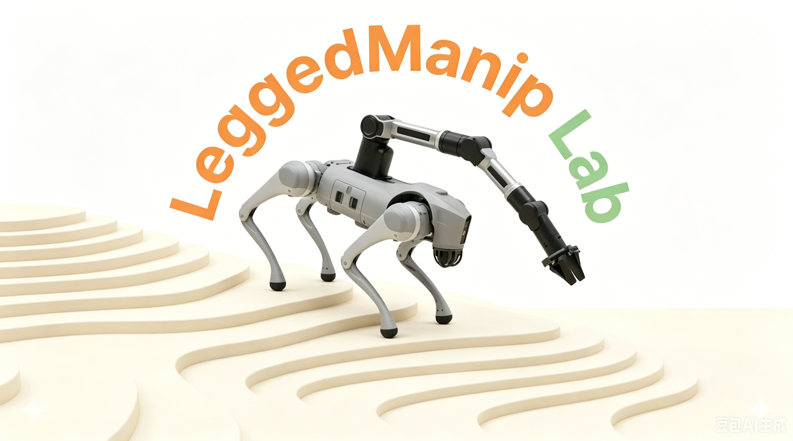
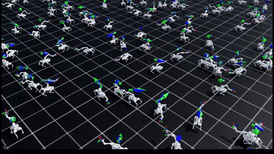
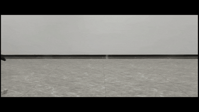
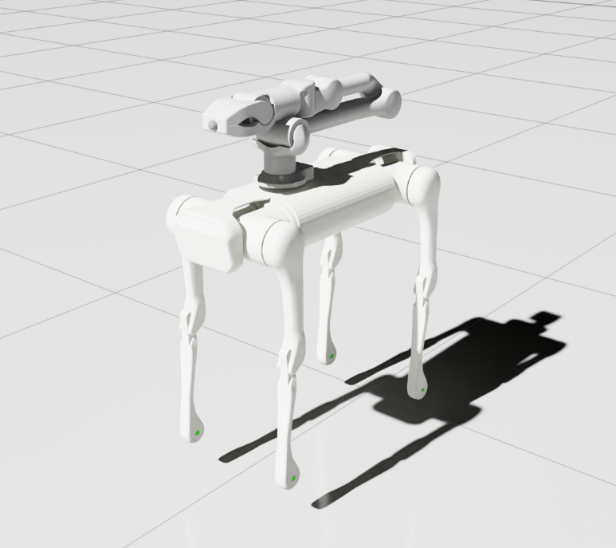
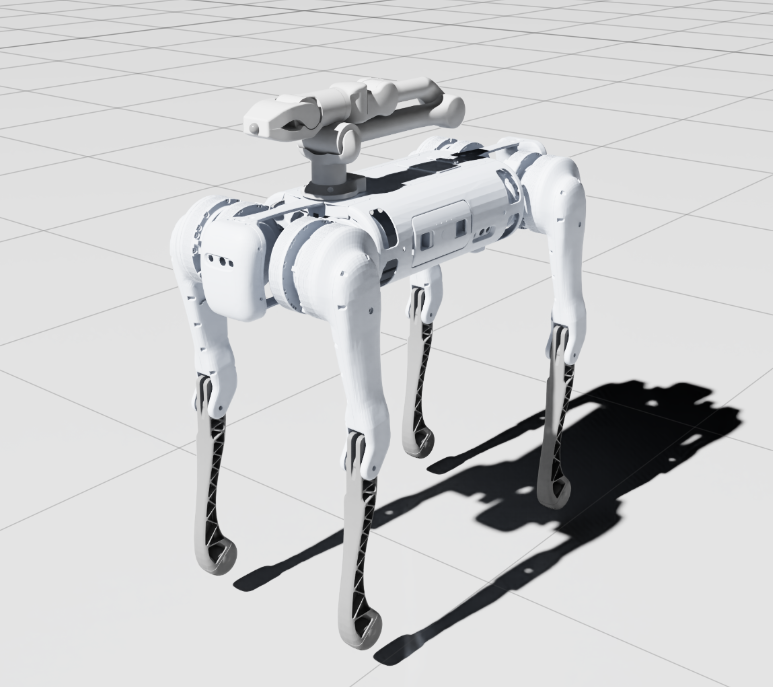
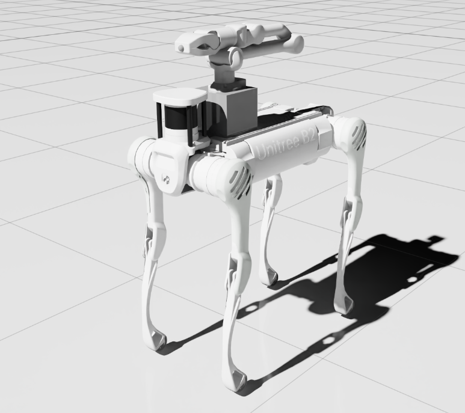
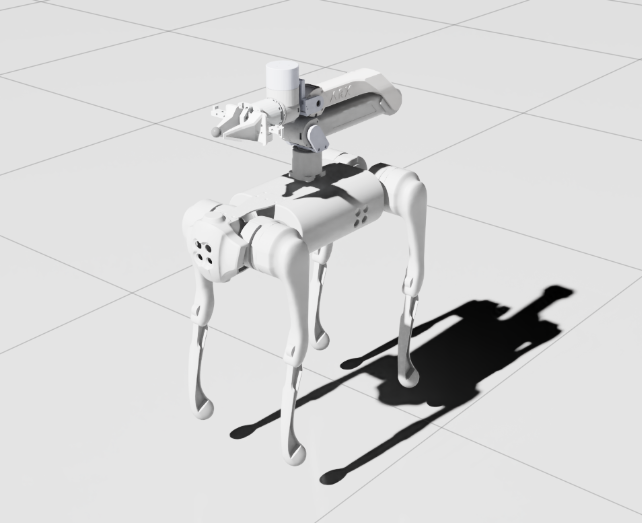
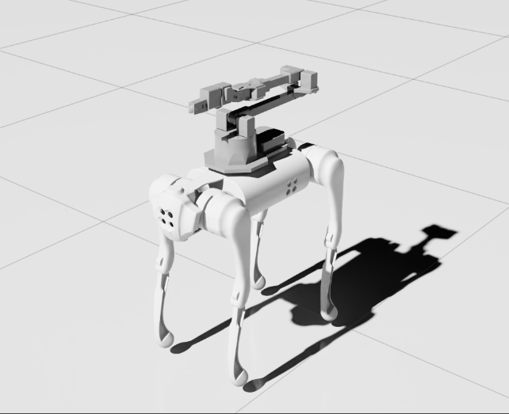
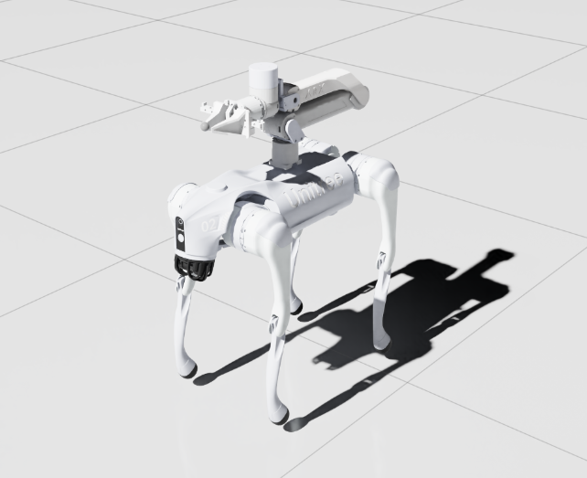
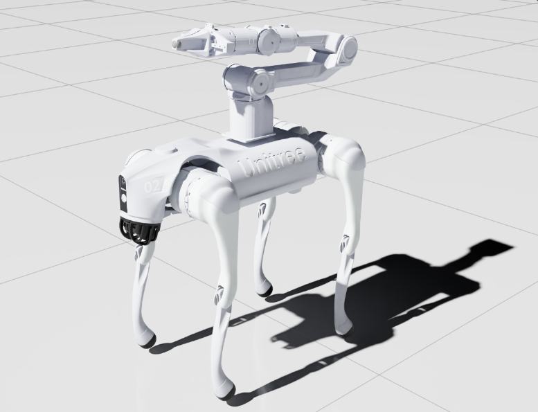

<p align="center">
  
</p>

# LeggedManip Lab

[](https://docs.isaacsim.omniverse.nvidia.com/latest/index.html)
[](https://github.com/isaac-sim/IsaacLab/tree/main)
[](https://github.com/leggedrobotics/rsl_rl)
[](https://docs.python.org/3/whatsnew/3.11.html)
[](https://mujoco.org/)
[](https://releases.ubuntu.com/22.04/)
[](https://opensource.org/license/apache-2-0)

[English](README.md) | [中文](README_CN.md)


**A Reinforcement Learning (RL) framework for legged robots with manipulator arms**

Legged robots with manipulation arms present unique challenges — coordinating locomotion and dexterous manipulation simultaneously. LeggedManip Lab addresses this by providing a unified RL training framework built on Isaac Lab, supporting whole-body locomotion-manipulation policy training and deployment across 7 robot platforms, including Flat and Whole-Body Control (WBC) training modes.

<div align="center">

| <div align="center"> Isaac Lab </div> | <div align="center">  Mujoco </div> |  <div align="center"> Physical </div> |
|--- | --- | --- |
|  |  |  |

</div>

---

## Supported Robots

| Platform | Legged Robot | Arm | Screenshot |
|----------|:-----------:|:---:|:----:|
| AGO-Z1 | Unitree Aliengo | Unitree Z1 |  |
| B1-Z1 | Unitree B1 | Unitree Z1 |  |
| B2-Z1 | Unitree B2 | Unitree Z1 |  |
| GO1-ARX5 | Unitree Go1 | ARX-X5 |  |
| GO1-WX250S | Unitree Go1 | WX250S |  |
| GO2-ARX5 | Unitree Go2 | ARX-X5 |  |
| GO2-PIPER | Unitree Go2 | Agilex Piper |  |
| ... | ... | ... | ... |

Each platform supports the following **2** training modes:

- **Flat** — Locomotion + manipulation on flat terrain
- **WBC** — Whole-body control with end-effector pose tracking in [mixed frame](docs/WBC_MIXED_FRAME.md)

---

## Roadmap

| Feature | Status |
|---------|--------|
| Flat terrain | ✅ Released |
| Whole-body control (WBC) | ✅ Released |
| Sim-to-Sim transfer | ✅ Released |
| Sim-to-Real transfer | 🔜 Coming Soon |

---

## Installation

### Prerequisites

- Install Isaac Lab by following the [official installation guide](https://isaac-sim.github.io/IsaacLab/main/source/setup/installation/index.html).
  We recommend using the conda installation as it simplifies calling Python scripts from the terminal.

> [!IMPORTANT]
> This repository currently targets the Isaac Lab `main` branch with the newer RSL-RL config API.
> Please do **not** use the Isaac Lab `v2.3.2` release tag, since it depends on `rsl-rl-lib==3.1.2` and is incompatible with the current agent configs.
>
> Required:
> - Isaac Sim: `5.1.0`
> - Isaac Lab: `main` branch
> - rsl-rl-lib: `>=5.0.1`
> - Python: `3.11`

**[Recommended one-click install](https://docs.robotsfan.com/isaaclab/source/setup/oneclick_installation.html)**:

```bash
wget -O install_isaaclab.sh https://docs.robotsfan.com/install_isaaclab.sh && bash install_isaaclab.sh
```

After installation, please verify the installed RSL-RL version:

```bash
python -m pip show rsl-rl-lib
```

The version should be `5.0.1` or newer. If it shows `3.1.2`, you are likely using the Isaac Lab `v2.3.2` release tag, which is not compatible with this repository.

### Install LeggedManip Lab

- Clone this repository separately from the Isaac Lab installation (i.e. outside the `IsaacLab` directory):

```bash
cd LeggedManip_Lab
python -m pip install -e source/LeggedManip_Lab
```

### Install Dependencies

- Install the additional Python dependencies for MuJoCo deployment and utilities:

```bash
pip install -r requirements.txt
```

---

## Quick Start

### List Available Environments

```bash
python scripts/list_envs.py
```

### Training

Train a policy with RSL-RL PPO:

```bash
# Flat terrain training
python scripts/rsl_rl/train.py --task GO2-PIPER-Flat --num_envs 4096 --headless --max_iterations 5000

# Whole-body control training
python scripts/rsl_rl/train.py --task GO2-PIPER-WBC --num_envs 4096 --headless --max_iterations 5000
```

### Play / Inference

```bash
python scripts/rsl_rl/play.py --task GO2-PIPER-Flat --headless
```

### Debug

```bash
python scripts/zero_agent.py --task GO2-PIPER-Flat    # Zero-action agent
python scripts/random_agent.py --task GO2-PIPER-Flat  # Random-action agent
```

---

## MuJoCo Deployment

### Run Trained Policies in MuJoCo

**Step 1 — Export the policy.** The play script automatically exports `policy.pt` (TorchScript) and `policy.onnx` upon loading your trained checkpoint:

```bash
python scripts/rsl_rl/play.py --task GO2-PIPER-Flat
```

The exported files are saved to `logs/rsl_rl/{experiment_name}/{run_name}/exported/`.

**Step 2 — Copy the policy** to the corresponding robot's policy folder:

```bash
cp logs/rsl_rl/{experiment_name}/{run_name}/exported/policy.pt mujoco/deploy/policy/{robot}/
```

**Step 3 — Run in MuJoCo** using the platform deployment script:

```bash
python mujoco/deploy/deploy_mujoco/{robot}/{robot}.py {config_name}.yaml
```

**Example: Running GO2-PIPER**

```bash
# 1. Export
python scripts/rsl_rl/play.py --task GO2-PIPER-Flat

# 2. Copy
cp logs/rsl_rl/go2_piper_flat/2026-01-01_00-00-00/exported/policy.pt mujoco/deploy/policy/go2_piper/

# 3. Deploy
python mujoco/deploy/deploy_mujoco/go2_piper/go2_piper.py config.yaml
```

### Keyboard Teleoperation

| Key | Robot Movement | Key | End-Effector Translation | Key | End-Effector Rotation |
|------|---------------|------|-------------------------|------|----------------------|
| W | Move forward | I | Move forward | 1 | Roll clockwise |
| S | Move backward | K | Move backward | 2 | Roll counterclockwise |
| A | Move left | J | Move left | 3 | Pitch clockwise |
| D | Move right | L | Move right | 4 | Pitch counterclockwise |
| Q | Turn left | U | Move up | 5 | Yaw clockwise |
| E | Turn right | O | Move down | 6 | Yaw counterclockwise |
| R | Reset all commands | | | | |

---

## Documentation

- [Environment Details, Project Structure & Key Files](docs/ENV_DETAILS.md)

---

## Troubleshooting

### Pylance Missing Indexing of Extensions

In some VsCode versions, the indexing of part of the extensions is missing. In this case, add the path to your extension in `.vscode/settings.json` under the key `"python.analysis.extraPaths"`.

> **Note: Replace `<path-to-isaac-lab>` with your own IsaacLab path.**

```json
{
    "python.languageServer": "Pylance",
    "python.analysis.extraPaths": [
        "${workspaceFolder}/source/LeggedManip_Lab",
        "/<path-to-isaac-lab>/source/isaaclab",
        "/<path-to-isaac-lab>/source/isaaclab_assets",
        "/<path-to-isaac-lab>/source/isaaclab_mimic",
        "/<path-to-isaac-lab>/source/isaaclab_rl",
        "/<path-to-isaac-lab>/source/isaaclab_tasks"
    ]
}
```

---

## Citation

Please cite the following if you use this code or parts of it:

```bibtex
@software{junjiezhu2026LeggedManip_Lab,
  author = {Junjie Zhu},
  title  = {LeggedManip_Lab: A Reinforcement Learning Framework for Legged Manipulation},
  url    = {https://github.com/zzzJie-Robot/LeggedManip_Lab},
  year   = {2026}
}
```

---

## Acknowledgements

The project uses some code from the following open-source code repositories:

- [fan-ziqi/robot_lab](https://github.com/fan-ziqi/robot_lab)
- [unitreerobotics/unitree_mujoco](https://github.com/unitreerobotics/unitree_mujoco)
- [google-deepmind/mujoco](https://github.com/google-deepmind/mujoco)
